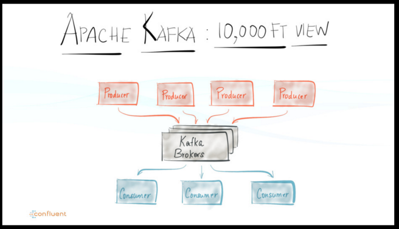

#Romancing the Confluent Platform 2.0 with Apache Kafka 0.9: A Simple Producer and Consumer Example

[source: Demystifiy Streaming Processing] (https://speakerdeck.com/nehanarkhede/demystifying-stream-processing-with-apache-kafka?utm_content=bufferd17aa&utm_medium=social&utm_source=twitter.com&utm_campaign=buffer)

##Thou Shall Publish...Thy Shall Subscribe...
For as long as there have been printing papers, there have been publishers and consumers. 
In ancient times the King's scribes were the publishers, the pigeon the courier or transport, and remote Lords of the Houses the consumers or subscribers. In modern times, in the digital era, data is securely and reliably published and selectively subscribed.In other words, the publish/subscribe paradigm is not new; it's old.

Today's messaging systems such Tibco, Java Messaging Service (JMS), RabbitMQ, Amazon SQS. etc are some examples of frameworks and platforms built on this paradigm for publishing and subscribing data and writing distributed streaming applications.

Add to that list a realtime streaming platform—and you get scalable, fault-tolerant and reliable messaging network with low-latency, allowing you to build and connect your disparate source sources for both realtime and batch applications quickly and easily. One such data streaming and messaging platform is [Confluent Platform.] (http://confluent.io)

A key challenge in all these aforementioned messaging systems, including scale, reliability and security, is can they guarantee that the *right data* goes to the *right place*, within an acceptable latency? 

Confluent founders declare that it's their mission to "make sure data ends up in all the right places."

I had a go at it to ascertain, as a developer, my "get-started" experience. For all platforms today, the "get-started" is your initial feel for what to expect; it's imperative that your experience is positive; it's unimpeded and unencumbered; it's akin to your first date, if you will. As you know first impressions matter!

##The Rule of Three##
The central notion and litmus tests are simple: how easy it's for any developer to do the following:
- Download, Install and configure the platform
- Run it in local mode, not cluster mode
- Write with relative ease a first Hello World equivalent, in the supported SDK in language of choice

I abide by the moto: *Less friction to development invariably leads to more (and rapid) adoption and acceptance*.

While my goal on this first date is not to explore and embrace on all features of the platform, it is to write a simple, putative rendition of HelloWorld equivalent of Publish/Subscribe paradigm programming model, using the  
[Confluent Platform 2.0 (CP)](http://confluent.io), backed and supported by creators of [Apache Kafka (0.9.0)](http://kafka.apache.org), originally developed at LinkedIn.

My examplea are derived from two sources:
- [The Confluent examples on Github] (https://github.com/dmatrix/examples-1/blob/master/README.md)
- [An IoT Device Simulation with PubNub-Part 1] (https://github.com/dmatrix/examples/blob/master/pubnub/py/README.md)

Later, I'll implement an elaborate simulation of disparate data sources, large scale deployment of IoT devices all publishing data, in which I'll employ CP as the messaging system as I did with [PubNub](https://www.linkedin.com/pulse/pubnub-integration-apache-spark-influxdb-simulation-iot-damji) previously.

For now let's first crawl and have coffee with our first date before we run and have full course dinner...

##Relevant Files
###SimplePublisher.java (Producer)
As the name suggests, it's a simple producer of few fake devices' state data and publishes each device record to the CP topic "devices." Three key takeaways. First, each topic to which you wish to publish a message, you must provide and register an Avro schema. For the duration of process (and even later) all producers publishing to this topic must adhere to this schema, which is registered and maintained in the Schema Registery. 

Second, since by default CP uses Avoro ser/der for the messages, you get the benefit of most default data types ser/der out-of-the box. 

And finally, the Java client APIs are fairly easy (I have not tried other [client implementations](https://cwiki.apache.org/confluence/display/KAFKA/Clients#Clients-Python); but it's worth exploring at least Scala, Python or Go). I'll leave that as an exercise for other enthusiasts. 

To get started, let's compile and create a producer package. 

- cd into the publisher directory in this git repo.

	`$ mvn clean package`

This will create the jar file in the *target* directory. Once created, you can follow the *Steps To Run* below to publish device records.

###Command Line Consumer (Consumer)
I get excited when I can *learn, try and do* something both programmatically and interactively. No surprise that Python and Scala Read Evaluate Process and Loop (REPLs) are such a huge hit with developers, because they allow developer to prototype an idea quickly. No different are the UNIX shells. 

Not since the creators of UNIX shells—Bourne, Csh, and Bash—are computer scientists and software engineers today so inspired to consider providing interactive shell as part of their platform environment. Look at *PySpark* and Scala *spark-shell*, where developers can interact and try or test code—and see the results instanstaly. Why wait for something to compile when all you want is to quickly prototype a function or an object class, test and tweak it.

Just as REPLs are developers' delight, so are CLI tools and utilities that ship with a platform, allowing quick inspection, fostering rapid prototyping, and offering discrete blocks to build upon.

For example, in the CP's distribution's *bin* directory, I can use a number of command line scripts. One such utility allows you to inspect messages on a topic. This means, instead of writing a consumer yourself to do quick inspection, you can easily use one out-of-the-box. It comes handy, especially if you just finished publishing few messages on a topic and are curious to see if that worked. Here's a quick way to inspect topics.

To see what you just published on your topic, say *devices*, run this command:

	`$ kafka-avro-console-consumer --topic devices --zookeeper localhost:2181 --from-beginning`

Another example, and equally useful, is the *kafka-simple-consumer-shell*, which allows you to interactively inspect your topic queues and partitions.

	`$ kafka-simple-consumer-shell --broker-list localhost:8081 --topic devices --partition 0 --max-messages 25`

##Requirements
In order to try these examples you must download and insall the following on your laptop (Mine is a Mac)
- [Download and Install Confluent 2.0] (http://docs.confluent.io/2.0.0/quickstart.html)
- Download and Install Maven
- Download and Install JDK 1.7

##Steps to Runs

Assuming that you have satisfied the above requirements, here is the order of steps to get a *HelloWorld* publisher and consumer 
going. Further, let's assume you have CP installed in ${CONFLUENT_HOME}/bin and included in your $PATH.

1. Start the zookeeper in one terminal.

	`$ cd ${CONFLUENT_HOME} && zookeeper-server-start ./etc/kafka/zookeeper.properties`

2. Launch the Apache Kafka Server in a separate terminal.

	`$ cd ${CONFLUENT_HOME} && kafka-server-start ./etc/kafka/server.properties`

3. Start the Schema Registery in a separate terminal. 
	`$ cd ${CONFLUENT_HOME} && schema-registry-start ./etc/schema-registry/schema-registry.properties

4. In your publisher directory where you created the package execute the following command:

	`$ mvn exec:java -Dexec.mainClass="com.dmatrix.iot.devices.SimplePublisher" -Dexec.args="devices 5 http://localhost:8081"`

	This will publish five device messages to the topic 'devices.'

5. Finally, to see the outcome of what you published, fetch the messages 

	`$ cd ${CONFLUENT_HOME} && kafka-avro-console-consumer --topic devices --zookeeper localhost:2181 --from-beginning`

At this point, you should see all the messages recevied in the order published.

In short, the above recipe gets you started romancing with publish and subscribe paradigm using Confluent Platform 2.0. There's much more to its power and potential in the distributed data processing of data stream at massive scale. You can read the history, the motivation, testimonials, use-cases, and social proof of this platform, both from developers' and infrastructure point of view, if you peruse some of the resources. The spectrum of large scale deployment in production speaks volume of Apache Kafka's potential.

As I said earlier, what gets my passion flowing is the **get-started** positive experience. In general, in my opinion, any platform that takes inordinate amount of time to install, is difficult to configure and launch, and hard tolearn to write your equivalent Hello World program is a negative sign of *more* friction and resistance and *less* desire of adoption and acceptance.
To that extent, Confluent met my initial, "get-started" needs, with minimal friction.

Try it for yourself.

##Watch the Runs

## Resources for Further Exploration
- [Demystifying Stream Processing] (https://speakerdeck.com/nehanarkhede/demystifying-stream-processing-with-apache-kafka?utm_content=bufferd17aa&utm_medium=social&utm_source=twitter.com&utm_campaign=buffer)
- [An evening with Jay Kreps: author of Apache Kafka, Samza, Voldemort & Azkaban.](http://www.slideshare.net/sawjd/an-evening-with-jay-kreps-author-of-apache-kafka-samza-voldemort-azkaban)
- [What's Confluent Platform?](http://docs.confluent.io/2.0.0/platform.html)
- [Confluent Blogs] (http://www.confluent.io/blog)
- [Apache Kafka 0.9.0 Documentation] (http://kafka.apache.org/documentation.html)
- [Kafka Clients](http://docs.confluent.io/2.0.0/clients/apidocs.html)
- [RESTful API](http://docs.confluent.io/2.0.0/kafka-rest/docs/index.html)

## TODO
1. Implement a simulation of [Part 1] (https://github.com/dmatrix/examples/blob/master/pubnub/py/README.md) with Confluent Platform. 
