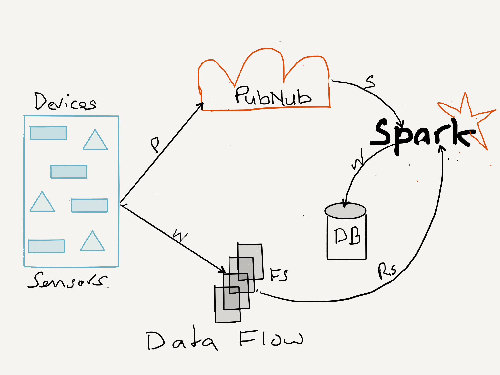
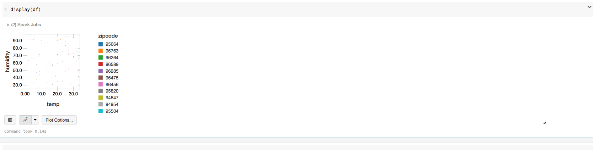
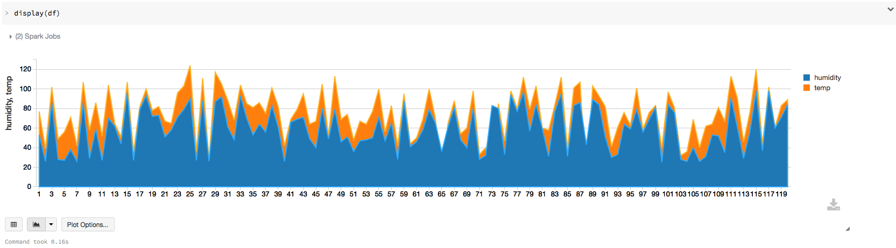
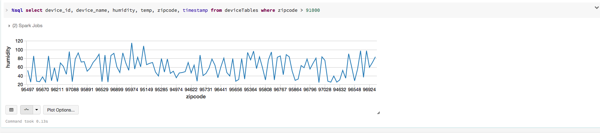

#PubNub Integration with Apache Spark and InfluxDB

Legend
- P = Publish
- S = Subscribe
- R = Read
- W = Write

***my woeful attempt to use [53 Pencil & Paper Sketch!] (https://www.fiftythree.com/)***

##Introduction
For as long as there have been papers, there have been publishers and respective consumers. Even today, in the digital era, data is securely and reliably published and selectively subscribed. In other words, the publish/subscribe paradigm is not new; it's ancient.

Products such Tibco, Java Messaging Service (JMS), RabbitMQ, Apache Kafka, Amazon SQS. etc are examples of frameworks and platforms built on this paradigm for publishing and subscribing selective data and writing distributed streaming applications.

But realtime streaming data networks are different. They're global, scalable, and reliable; they are low-latency. [PubNub]
(http://pubnub.com) is one such data streaming network that allows you to build and connect devices for realtime applications quickly and easily.

To have a go at it, I took it for a spin, using their [Python SDK](https://www.pubnub.com/developers/), to write my first Publish-Subscribe app. I went futher to integrate the app with [Apache Spark Streaming] (http://apache.spark.org)—and soon with [InfluxDB](http://influxdb.com). 

The diagram above shows the dataflow (Ah, my first woeful attempt to use [53 Pencil & Paper Sketch!] (https://www.fiftythree.com/)

Ideally and eventually, I'll want to be able to subcribe to published channels from within the Spark Streaming App. For now, because of debugging with PubNub pub/sub keys' issues, I'm cheating slightly, by publishing dataset to a local file system directory where the local Spark appplication monitors the directory for any published datasets.

Note that in this scenario, you can't run Spark Streaming App in a clustered or standlone mode. The Spark app will have to run in local mode on the same machine as pubnub publisher app.
##Device Simulation
I simulate as though a large installation of sensor devices in a particular zipcode area is publishing the state, temperature, and humidity data onto the PubNub Data Network on a well-known public channel "devices."

Interested parties can subscribe to this channel, particularly any app that's monitoring or provisioning devcies. In this case,I have my Spark Streaming App monitoring a directory.

Additionally, this Spark App (or any subsriber) can insert data into a timeseries database such as InfluxDB (on the to do list) for data visualization over period of time. This is useful for trending and monitoring usage.

For example, using the datasets published by this app with [Databricks Notebook Python] (https://github.com/dmatrix/examples/blob/master/spark/databricks/notebooks/py/sql_device_provisioning.ipynb) and [DataFrames & SQL] (http://spark.apache.org/docs/latest/sql-programming-guide.html), I can visualize different data fields along different axis. Below are few examples:

##Relevant Files
###pub_dev_words.py

This short example illustrates the simplicity of using PubNub Realtime Streaming Netowrk,
and how to use PubNub SDK to program the netowrk, to publish data streams or to subscribe data streams.

Though the example is simple, it simulates as though multiple devices are registering themselves or announcing their
availability by publishing their state on a dedicated channel. In reality this could be a deployment of meters or sensors
in an area code that you wish to monitor for tial and do some realtime analysis using Spark.

Also, as an optional extension, the app can write to a socket or a directory where a Spark Streaming context monitoring for live
live data streams of JSON objects from each device. For directory, the Spark application must run on the same JVM as this app and in local mode.

I employ a thread that simulates mulitple devices acting as publishers, but in reality each JSON data object could be published separately by each device using PubNub's publish-subscribe API. 

It downloads a list of words from the [Internet] (http://www.textfixer.com/resources/common-english-words.txt) and uses them as device names. Each JSON object has the 
following format:

     {"device_id": 97, 
     "timestamp", 1447886791.607918,
     "lat": 22, 
     "long": 82, 
     "scale: 
     "Celius", 
     "temp": 22, 
     "device_name": "sensor-mac-word",
     "humidity": 15,
     "zipcode:" 95498
    }

 To run this program to create json files into the destinattion directory for Spark Streaming consumption:
     `$ python pub_dev_words.py -u http://www.textfixer.com/resources/common-english-words.txt -c devices -i 1 -d data`

###pubnub_dir_streaming.py
 This short example demonstrates how to consume a json dataset stream directory from a pubnub publisher that writes dataset files into a destination directory.

Its counter part PubNub publisher, *pub_dev_words.py*, publishes to a channel devices and also dumps it to a data directory
for this Spark Streaming program to consume. While it does not diretory use PubNub subscriber API to get the item, the next
step is to modify this app so that it employ's PubNub's subscribe channel to recieve publishe data.

(At the moment I having trouble getting publish.subscribe to work. Some problem with the keys. But for now this work around should
for running both publisher (*pub_dev_workds.py*) and subscriber (*pubnub_dir_streaming.py*) on the same machine)

Ideally, you want the this Spark app to run on the cluster and directly subscrbe from the PubNub Data Network Stream.
(stay tune... coming soon)

Though short and simple, it illustrates Spark's brevity in doing more with little. 

Simplicity does not preclude profundity. Once can achieve a lot by doing little, and that has been the appeal and draw of Spark Core API.

    `$ bin/spark-submit pubnub_dir_streaming.py data_dir`
##Requirements

In order to run these two applications you will need the following:
- Trial account with PubNub
- Install PubNub Python SDK 
- Apache Spark on your local machine running in local mode
- InfluxDB and Python SDK

##TO DO
1. Integrate with InfluxDB
2. Fix PubNub subscribe() keys issues
3. Include Pubnub.subscribe() calls within the Spark Streaming App
