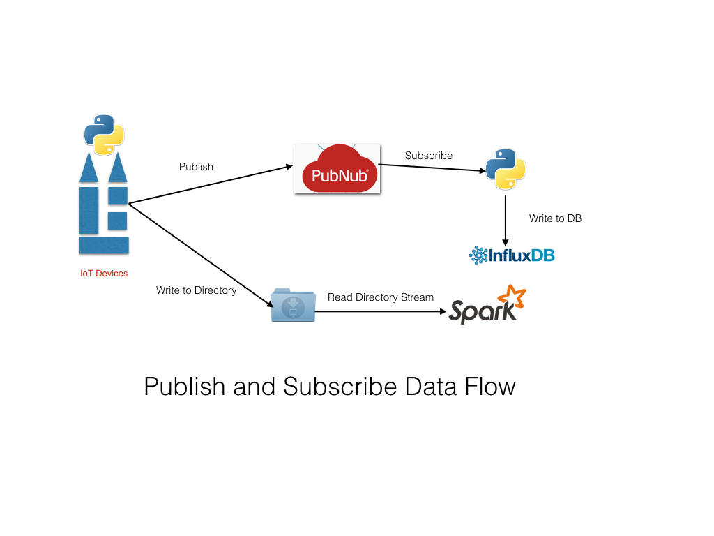
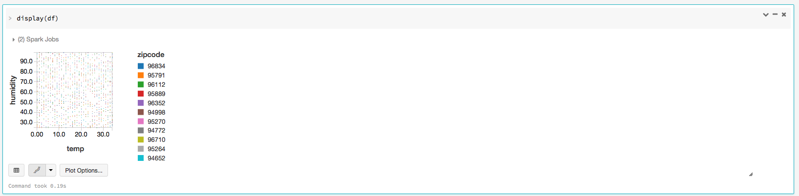
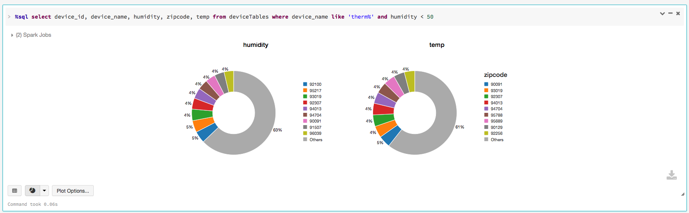

#PubNub Integration with Apache Spark and InfluxDB

##Thou Shall Publish...Thy Shall Subscribe...
For as long as there have been printing papers, there have been publishers and consumers. 
In ancient times the King's scribes were the publishers, the pigeon the courier or transport, and remote Lords of the Houses the consumers or subscribers. In modern times, in the digital era, data is securely and reliably published and selectively subscribed. In other words, the publish/subscribe paradigm is not new; it's old.

Today's messaging systems such Tibco, Java Messaging Service (JMS), RabbitMQ, Apache Kafka, Amazon SQS. etc are examples of frameworks and platforms built on this paradigm for publishing and subscribing data and writing distributed streaming applications.

Add to that list a realtime streaming data network—and you get global, scalable, and reliable messaging network with sub-second low-latency, allowing you to build and connect Internet of Devices (IoT) for realtime applications quickly and easily. One such data streaming and messaging network is [PubNub.] (http://pubnub.com)

I used it to publish (or simulate) realtime sensor or device data, using its [Python SDK](https://www.pubnub.com/developers/), to write my first Io publish-subscribe app. To make things interesting, I went further to integrate the app with [Apache Spark Streaming] (http://apache.spark.org)—and ingest data into timeseries [InfluxDB](http://influxdb.com) database.

The diagram above shows the dataflow.

Ideally, I'm going to want to subcribe to a published channel from within the Spark Streaming App, but for now I have a another Python subscriber that subscribes to this channel, and inserts data into InfuxDB.

Note that in this scenario, I'm running Spark Streaming App in local mode, on the same machine as pubnub publisher app. As such, it makes it easier for developer to quickly *learn, try and do things*.

##Device Simulation
I simulate as though a large installation of sensors and devices in a particular zipcode area is publishing the device state, temperature, and humidity data on to the PubNub Data Network on a well-known public channel "devices."

Interested parties can subscribe to this channel, particularly any app that's monitoring or provisioning devices. In this case,I have my Spark Streaming App monitoring a directory, and a Python PubNub process that's subscribing to this channel.

Additionally, this Spark App (or any subscriber) can insert data into a timeseries database such as InfluxDB. For data visualization over period of time, which is useful for trending and monitoring usage, I have used Databrick Cloud Python and Scala Notebooks.

For example, using the datasets published by this app with [Databricks Notebook Python] (https://github.com/dmatrix/examples/blob/master/spark/databricks/notebooks/py/sql_device_provisioning.ipynb) and [Spark DataFrames & SQL] (http://spark.apache.org/docs/latest/sql-programming-guide.html), I can visualize and query different data fields. Below are few examples:

##Relevant Files
###publish_devices.py (Publisher)

This short example illustrates the simplicity of using PubNub Realtime Streaming Data Netowrk,
and how to use PubNub SDK to publish or subscribe to data streams.

Though the example is simple, it simulates as if multiple devices and sensors are registering themselves by publishing their state on a dedicated channel. In reality, however, this could be a deployment of meters or sensors in an area code that you wish to monitor for a trial deployment and do some realtime analysis using Spark.

Also, as an optional extension, the app can write to a socket or a directory where a Spark Streaming is monitoring for live
 data streams of JSON objects from each device. For directory monitoring of new files, the Spark application must run on the same JVM as this app—and the Spark streaming app in Spark's local mode.

I employ a thread that simulates multiple devices and sensors acting as publishers, but in reality each JSON data object could be published separately by each IoT device using PubNub's SDK. 

The thread creates a list of random devices, the number specified on the command line, and uses them as device ids. Each JSON object generated has the following format:

     {"device_id": 1,
     "ip": "191.35.83.75",  
     "timestamp:", 1447886791.607918,
     "lat": 22, 
     "long": 82, 
     "scale: "Celsius", 
     "temp": 22, 
     "device_name": "sensor-mac-id<random_string>",
     "humidity": 15,
     "zipcode:" 95498
    }
As a developer, one huge attraction is how easy it's to write a PubNub publisher, using its SDK: a) instantiate a Pubnub handle b) define the right async callbacks, and c) publish data or message to a channel. 

All the complexity (and reliability) is handled and hidden by the network infrastructure. Only thing a developer ought to worry about is writing code on that IoT device that does the publishing of realtime or periodic data to single or multiple subscribers listening on channels on PubNub's streaming data network.

 To run this program to create JSON files into the destinattion directory for Spark Streaming consumption:

     `$ python publish_devices.py --channel CHANNEL --number NUMBER --iterations ITERATIONS --data_dir DATA_DIRECTORY`

###subscribe_devices.py (Subscriber)
Unlike its counter part *publish_devices.py*, this simple Python process subscribes to the messages published on the specified channel, "devices." Using simple PubNub API to subscribe messages, and upon receiving messages, it writes to a timeseries DB like InfluxDB.

To run this program to subscribe to device JSON files, run this command:

    `$ python subscribe_devices.py --channel devices --host localhost --port 8086`

Note: You must run this program first, before publishing. PubNub requires that subscribers attach or subscribe to channels before they can receive messages published on channels.

###pubnub_dir_streaming.py (Consumer)
Finally, this short Spark example demonstrates how to consume a JSON data stream from a directory. 

Its counter part PubNub publisher, *publish_devices.py*, publishes to a channel and also writes JSON data to a desinated directory for this Spark Streaming program to consume. While presently it does not use PubNub subscriber API to get data directly off a channel, the next step is to modify this app so that it employs PubNub's subscribe channel to recieve published data.

Though short and simple, it illustrates Spark's brevity in doing more with little. Simplicity does not preclude profundity: One can achieve a lot by doing little, and that has been the appeal and draw of Spark Core API.

    `$ bin/spark-submit pubnub_dir_streaming.py data_dir`

##Requirements

In order to run these three applications you will need the following:
- Trial account with PubNub for sub/pub keys
- Install InfluxDB on the localhost
- Install Apache Spark on your local machine and run in local mode
- Install InfluxDB and its respective Python SDK

##STEPS 
For better results start each Python process in a separate terminal window in the order specified below.

1. Start the PubNub Python subscriber in a terminal.

    `$ python subscribe_devices.py --channel devices --host localhost --port 8086`

2. Start the Spark Python Streaming application in a separate terminal

    
    `$ bin/spark-submit pubnub_dir_streaming.py data_dir`

3. Start the PubNub Python publisher in a separate terminal

     `$ python publish_devices.py --channel devices --number 50 --iterations 3 --data_dir data_dir`

4. If you have [Databricks Cloud](http://databricks.com) trial account, have a go at these Python and Scala Notebooks:

- [Python Notebook](https://github.com/dmatrix/examples/blob/master/spark/databricks/notebooks/py/sql_device_provisioning.ipynb)
- [Scala Notebook](https://github.com/dmatrix/examples/blob/master/spark/databricks/notebooks/scala/sql_scala_device_provisioning.scala)

##WATCH THE RUNS
To see the processes in action, here is a short screencast

##What's Next Screencast: TO DO 
1. Next replace PubNub with Apache Kafka and use its API to publish and subscribe topics
2. Use the Kafka-Spark Connector to fetch data for the Spark Streaming App.