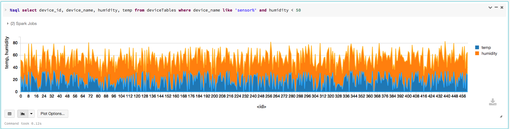

#PubNub Integration with Apache Spark and InfluxDB

Legend
- P = Publish
- S = Subscribe
- R = Read
- Rs = Read Data Stream
- W = Write

***my woeful attempt to use [53 Pencil & Paper Sketch!] (https://www.fiftythree.com/)***

##Thou Shall Publish...Thy Shall Subscribe...
For as long as there have been papers, there have been publishers and consumers. 
Back then the King's scribes were the publishers, the pigeon the courier or transport, and remote Lords of the Houses the consumers. In modern times, in the digital era, data is securely and reliably published and selectively subscribed. In other words, the publish/subscribe paradigm is not new; it's ancient.

Today's messaging systems such Tibco, Java Messaging Service (JMS), RabbitMQ, Apache Kafka, Amazon SQS. etc are examples of frameworks and platforms built on this paradigm for publishing and subscribing data and writing distributed streaming applications.

Add to that list a realtime streaming data network—and you get global, scalable, and reliable messaging network with sub-second low-latency, allowing you to build and connect devices for realtime applications quickly and easily. One such data streaming and messaging network is [PubNub.] (http://pubnub.com)

I used it to publish (or simulate) realtime sensor or device data, using its [Python SDK](https://www.pubnub.com/developers/), to write my first Publish-Subscribe app. To make things interesting, I went futher to integrate the app with [Apache Spark Streaming] (http://apache.spark.org)—and soon to come with [InfluxDB](http://influxdb.com)

The diagram above shows the dataflow (Ah, my first woeful attempt to use [53 Pencil & Paper Sketch!] (https://www.fiftythree.com/)

Ideally, I'm going to want to subcribe to a published channel from within the Spark Streaming App. For now, because of debugging with PubNub pub/sub keys' issues, I'm cheating slightly, by publishing dataset to a local file system directory where the local Spark appplication monitors the directory for any published datasets.

Note that in this scenario, you can't run Spark Streaming App in a clustered or standlone mode. The Spark app must run in local mode on the same machine as pubnub publisher app.
##Device Simulation
I simulate as though a large installation of sensors and devices in a particular zipcode area is publishing the state, temperature, and humidity data onto the PubNub Data Network on a well-known public channel "devices."

Interested parties can subscribe to this channel, particularly any app that's monitoring or provisioning devcies. In this case,I have my Spark Streaming App monitoring a directory.

Additionally, this Spark App (or any subscriber) can insert data into a timeseries database such as InfluxDB (on the to do list) for data visualization over period of time, which is useful for trending and monitoring usage.

For example, using the datasets published by this app with [Databricks Notebook Python] (https://github.com/dmatrix/examples/blob/master/spark/databricks/notebooks/py/sql_device_provisioning.ipynb) and [DataFrames & SQL] (http://spark.apache.org/docs/latest/sql-programming-guide.html), I can visualize and query different data fields. Below are few examples:

![] (images/screen_5.png "Humidity vs Temp Cluster Map")
![] (images/screen_6.png "Humidity vs Temp Pie Chart")

##Relevant Files
###publish_devices.py (Publisher)

This short example illustrates the simplicity of using PubNub Realtime Streaming Data Netowrk,
and how to use PubNub SDK to publish data streams or to subscribe to data streams.

Though the example is simple, it simulates as though multiple devices and sensors are registering themselves or announcing their availability by publishing their state on a dedicated channel. In reality this could be a deployment of meters or sensors in an area code that you wish to monitor for a trial deployment and do some realtime analysis using Spark.

Also, as an optional extension, the app can write to a socket or a directory where a Spark Streaming is monitoring for live
 data streams of JSON objects from each device. For directory monitoring of new files, the Spark application must run on the same JVM as this app and in Spark's local mode.

I employ a thread that simulates mulitple devices acting as publishers, but in reality each JSON data object could be published separately by each device using PubNub's SDK. 

It creates a list of random devices devices and uses them as device names. Each JSON object has the 
following format:

     {"device_id": 1,
     "ip": "191.35.83.75",  
     "timestamp:", 1447886791.607918,
     "lat": 22, 
     "long": 82, 
     "scale: 
     "Celius", 
     "temp": 22, 
     "device_name": "sensor-mac-id<random_string>",
     "humidity": 15,
     "zipcode:" 95498
    }
As a developer, one huge attraction is how easy it's to write a PubNub publisher, using its SDK: a) instantiate a Pubnub handle b) define the right async callbacks, and c) publish data or message to a channel. 

All the complexity (and reliablity) is handled and hidden by the network. That's is a huge productivity win for a developer who wants to connect devices and transmit realtime or periodic data to single or multiple subscribers listening on channels on PubNub's streaming data network.

 To run this program to create JSON files into the destinattion directory for Spark Streaming consumption:

     `$ python publish_devices.py -n number_of_devices -c devices -i 1 -d data`

###subscribe_devices.py (Subscriber)
UnLike its counter part *publish_devices.py*, this simple Python process subscribes to the messages published on the specified channel. Using simple PubNub API to subscribe messages, it can either write to an repository timeseries DB like InfluxDB (on the TODO list) or write to NoSQL datastore such as Casandra (on the todo list).

To run this program to subscribe to device JSON files, run this command:

    `$ python subscribe_devices.py -c channel`

Note: You must run this program first, before publishing. PubNub requires that subscribers attach or subscribe to channels first, before they can recieve messages published on the channels.

###pubnub_dir_streaming.py (Consumer)
 This short Spark example demonstrates how to consume a JSON dataset stream from directory. A publisher writes dataset as text files into a designated directory.

Its counter part PubNub publisher, *publish_devices.py*, publishes to a channel and also writes JSON data to a data directory
for this Spark Streaming program to consume. While presently it does not use PubNub subscriber API to get data directly off a channel, the next step is to modify this app so that it employs PubNub's subscribe channel to recieve published data (on the TODO list).

Though short and simple, it illustrates Spark's brevity in doing more with little. 

Simplicity does not preclude profundity: One can achieve a lot by doing little, and that has been the appeal and draw of Spark Core API.

    `$ bin/spark-submit pubnub_dir_streaming.py data_dir`
##Requirements

In order to run these three applications you will need the following:
- Trial account with PubNub for sub/pub keys
- Install PubNub Python SDK 
- Apache Spark on your local machine running in local mode
- InfluxDB or Cassandra and Python SDK

##STEPS 
For better results start each Python process in a different terminal window in the order specified below.

1. Start the PubNub Python subscriber in a terminal.

    `$ python subscribe_devices.py -c channel`

2. Start the Spark Python Streaming application a terminal

    
    `$ bin/spark-submit pubnub_dir_streaming.py data_dir`

3. Start the PubNub Python publisher in a terminal

     `$ python publish_devices.py -n number_of_devices -c devices -i 1 -d data`

4. If you have [Databricks Cloud] (http://databricks.com) trial account, have a go at these Python and Scala Notebooks:

- [Python Notebook] (https://github.com/dmatrix/examples/blob/master/spark/databricks/notebooks/py/sql_device_provisioning.ipynb)
- [Scala Notebook] (https://github.com/dmatrix/examples/blob/master/spark/databricks/notebooks/scala/sql_scala_device_provisioning.scala)

###WATCH THE RUNS
To see the program runs, here is a short screencast

##TO DO 
1. Integrate with InfluxDB
2. Integrate with Cassandra